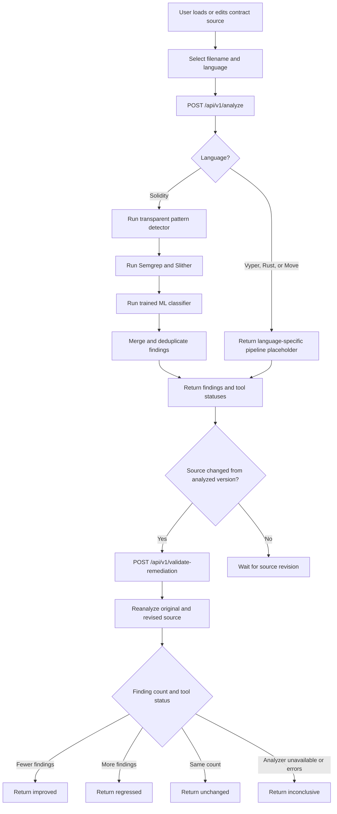

# SecureXAI Project Outcomes

## Research Gap Addressed

The reviewed literature tends to optimize one of three dimensions:

1. high detection performance for a narrow vulnerability class
2. explainable AI-based auditing
3. comparison with traditional analyzers

SecureXAI combines these dimensions into a single workflow for Solidity
developers and auditors.

## Target Outcomes

### 1. Multi-class detection

Detect reentrancy, access-control weaknesses, arithmetic issues, unchecked
external calls, dangerous operations, and additional classes added through
Semgrep, Slither, Mythril, and future ML models.

### 2. Actionable explanations

Every finding should include the responsible line or code region, category,
severity, confidence, explanation, recommendation, and detection source.

### 3. Tool benchmarking

The dashboard should compare findings from the custom detector, Semgrep,
Slither, and Mythril. Results should distinguish true positives, false
positives, duplicates, and tool-specific detections when ground truth is
available.

### 4. Reviewed remediation

Developers can revise source manually and compare the original and revised
versions through the analyzer rescan workflow before adoption.

### 5. Reproducible evaluation

Evaluation should report precision, recall, F1-score, accuracy where
appropriate, ROC-AUC for classifiers, false-positive rate, runtime, and tool
coverage over a documented dataset.

## Current Baseline

The repository currently implements:

- a FastAPI analysis API
- a transparent Python pattern detector
- structured line-level findings
- severity and confidence fields
- a React client connected to the API
- CORS support for local development

These are implementation outcomes, not final research results. Numerical
performance claims should be added only after dataset-based experiments.

## Current Workflow

The current client workflow is analysis first, followed by manual source
revision and revised-source validation. Validation compares normalized finding
counts and still requires human review.

## Planned Evidence

The project will support its claims with:

- labeled vulnerable and benign Solidity samples
- fixed train, validation, and test splits where ML is used
- tool version and configuration records
- normalized finding and ground-truth files
- benchmark tables and confusion matrices
- qualitative examples showing explanations and reviewed source changes